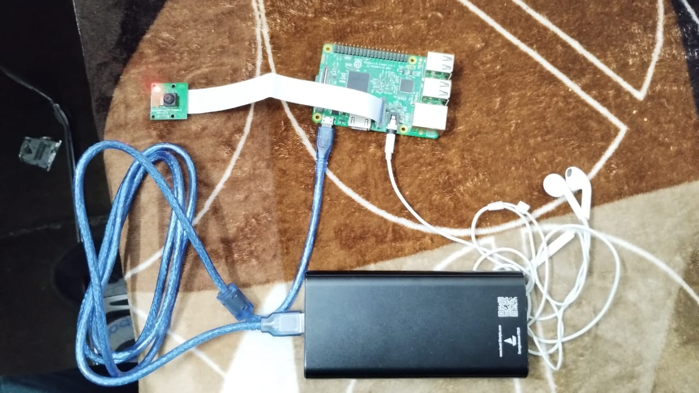
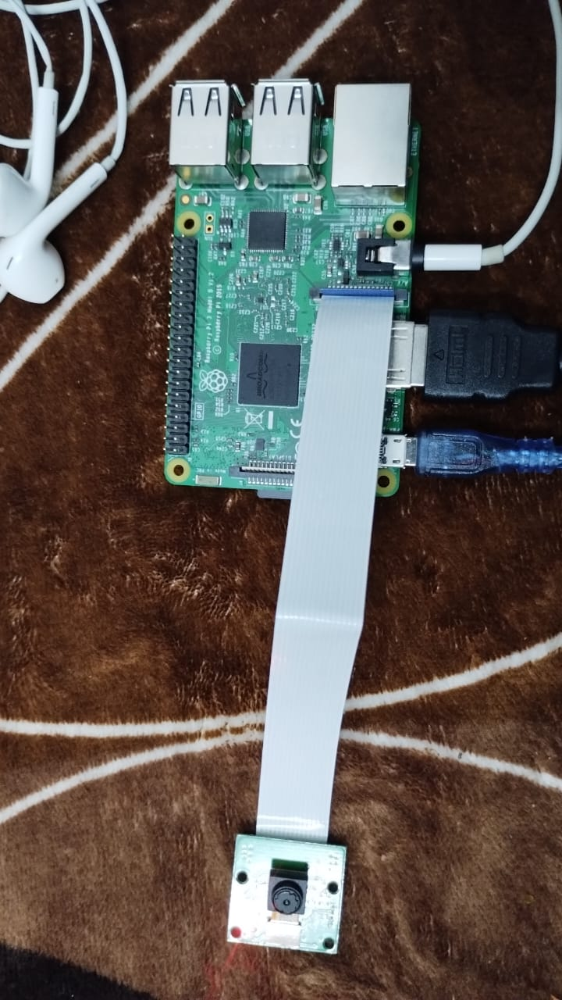

# N.E.T.R.A [Network for Enhanced Target Recognition and Assistance]


Hardware based object detection and Text to speech aimed to ease the daily life of blind people. 

# Software And Hardware Requirements

You will need the following software and hardware : 

1. Raspberry Pi 3B
2. Buster Operating System
3. Python3
4. Festival package from pygame
5. OpenCV
6. Earphones
7. B-Type Power Cable
8. Raspberry PI-Camera
9. Power Bank
10. Monitor with HDMI cable connection
11. HDMI cable

# Set-UP

If you don't already have Buster OS, you can download it from <a href="https://downloads.raspberrypi.org/raspbian/images/raspbian-2020-02-14/"> here</a>.

Now connect your R-PI with HDMI cable , Earphone jack and power supply like this : 



The Full set Up should now look like this : 



Now connect the HDMI cable to the Monitor and wait for it to boot. 

Now install the required dependencies with : 

```sh
pip install cv2
pip install pygame
pip install festival
```

Once it starts, clone this repository and run 

```sh
python3 object-detection.py
```

If Everything is Set-Up correctly and the software dependencies are satisfied, you should see the following : 


Now, Its time to Set up a Service that will Make the code run automatically when the R-PI boots. 

Go to the Home directory and make a file startup.sh, in it write the following code : 

```sh
#!/bin/bash
python3 /path/to/Repository/Directory/object-detection.py
```

Now run 

```sh
chmod +x /home/pi/startup.sh # Given your username is pi
```

To Register a service, run the following command 

```sh
sudo nano /etc/systemd/system/startup_script.service
```

Add the Code provided in StartUp.service in it. 

To activate the script, run the following : 

```sh
sudo systemctl enable startup_script.service
sudo systemctl start startup_script.service
```

To check whether the service is correctly activated or not, run the following command : 

```sh
sudo systemctl status startup_script.service
```

If it returns OK , you are good to go and now you can run 

```sh
sudo reboot
```

which will restart the pi and now your pi is all set to start Detecting Objects in the surroundings and conveying them to you via text to speech. 

# Code BreakDown

Here's a detailed explanation of the code:

1. **Import necessary libraries**: The code starts by importing the required libraries, including OpenCV (cv2), subprocess, and Pygame.

2. **Load class names**: The class names of the objects the model can detect are loaded from a text file (coco.names). These class names are used to label the detected objects.

3. **Load the object detection model**: The code loads the pre-trained object detection model using the configuration file (ssd_mobilenet_v3_large_coco_2020_01_14.pbtxt) and weights file (frozen_inference_graph.pb). This model is used for object detection.

4. **Set input parameters for the model**: The code configures the input size, scale, mean, and swap channels for the object detection model.

5. **Define the getObjects function**: This function takes an image, detection threshold (thres), non-maximum suppression threshold (nms), and optional parameters for drawing and specifying objects to detect. It performs object detection on the input image, returning the image with bounding boxes drawn around detected objects and a list of object information.

6. **Main script**: The main part of the script initializes the webcam (VideoCapture) and sets its resolution to 640x480. It also generates an audio announcement to signal the start of object detection using Festival and Pygame.

7. **Real-time object detection loop**: The code enters a continuous loop to capture frames from the webcam. It then calls the getObjects function to detect objects in the frames. If objects are detected, it prints their information and generates text-to-speech announcements for each detected object using Festival and Pygame.

8. **Wait for user input**: The code waits for a key press (using cv2.waitKey(1)) to exit the loop. You can exit the program by pressing any key.

You can check out the References we used to make this project in the References Folder. 

# Contributors

1. Shourya Goel |  <a href="https://twitter.com/ShogLoFi">**shogo**</a>
2. Aman Bawane |  <a href="https://twitter.com/Abnwamsn">**4m4n-x-b4w4ne**</a>
3. Atul Kumar |   <a href="https://github.com/atul-k-6">**Simp**</a>
4. Kshitij Shah |  <a href="https://github.com/KshitijIITRoorkee">**KS**</a>
